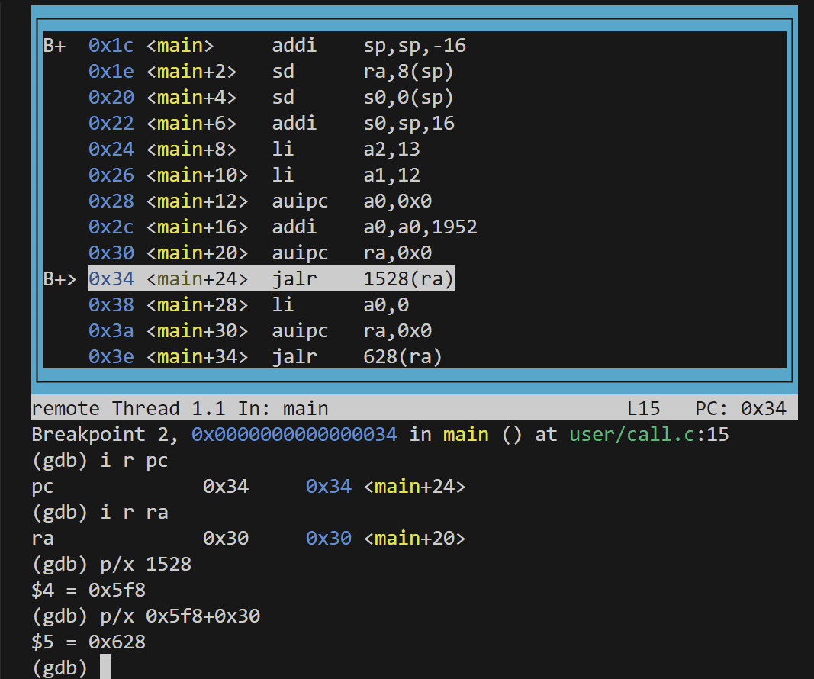

# RISC-V assembly (easy)
It will be important to understand a bit of RISC-V assembly, which you were exposed to in 6.004. There is a file user/call.c in your xv6 repo. make fs.img compiles it and also produces a readable assembly version of the program in user/call.asm.
Read the code in call.asm for the functions g, f, and main. The instruction manual for RISC-V is on the reference page. Here are some questions that you should answer (store the answers in a file answers-traps.txt):
```asm
0000000000000000 <g>:
#include "kernel/param.h"
#include "kernel/types.h"
#include "kernel/stat.h"
#include "user/user.h"

int g(int x) {
   0:	1141                	addi	sp,sp,-16
   2:	e422                	sd	s0,8(sp)
   4:	0800                	addi	s0,sp,16
  return x+3;
}
   6:	250d                	addiw	a0,a0,3
   8:	6422                	ld	s0,8(sp)
   a:	0141                	addi	sp,sp,16
   c:	8082                	ret

000000000000000e <f>:

int f(int x) {
   e:	1141                	addi	sp,sp,-16
  10:	e422                	sd	s0,8(sp)
  12:	0800                	addi	s0,sp,16
  return g(x);
}
  14:	250d                	addiw	a0,a0,3
  16:	6422                	ld	s0,8(sp)
  18:	0141                	addi	sp,sp,16
  1a:	8082                	ret

000000000000001c <main>:

void main(void) {
  1c:	1141                	addi	sp,sp,-16
  1e:	e406                	sd	ra,8(sp)
  20:	e022                	sd	s0,0(sp)
  22:	0800                	addi	s0,sp,16
  printf("%d %d\n", f(8)+1, 13);
  24:	4635                	li	a2,13
  26:	45b1                	li	a1,12
  28:	00000517          	auipc	a0,0x0
  2c:	7a050513          	addi	a0,a0,1952 # 7c8 <malloc+0xe8>
  30:	00000097          	auipc	ra,0x0
  34:	5f8080e7          	jalr	1528(ra) # 628 <printf>
  exit(0);
  38:	4501                	li	a0,0
  3a:	00000097          	auipc	ra,0x0
  3e:	274080e7          	jalr	628(ra) # 2ae <exit>
```
- Which registers contain arguments to functions? For example, which register holds 13 in main's call to printf?
  函数的参数存在哪个寄存器？例如，printf函数调用的参数13在哪个寄存器？
  answer:a2
- Where is the call to function f in the assembly code for main? Where is the call to g? (Hint: the compiler may inline functions.)
  main调用f函数在汇编代码的哪里？g呢？（提示，编译器可能会内联函数）
  answer:没有调用f和g，正如hints所示，编译器将这个两个函数直接内联成8+3.
- At what address is the function printf located?
  printf的地址。
  answer:0x628(只用gdb调试)
- What value is in the register ra just after the jalr to printf in main?
  jalr跳转到printf时ra寄存器的值？
  
  answer:0x628
- Run the following code.
  ```c
	unsigned int i = 0x00646c72;
	printf("H%x Wo%s", 57616, &i);
  ```
  What is the output? Here's an ASCII table that maps bytes to characters.
  **answer**:HE110 World
  The output depends on that fact that the RISC-V is little-endian. If the RISC-V were instead big-endian what would you set i to in order to yield the same output? Would you need to change 57616 to a different value?
  **answer**:i = 0x72646c00 and 57616 no change

# Backtrace (moderate)
For debugging it is often useful to have a backtrace: a list of the function calls on the stack above the point at which the error occurred.
Implement a backtrace() function in kernel/printf.c. Insert a call to this function in sys_sleep, and then run bttest, which calls sys_sleep. Your output should be as follows: 
```sh
backtrace:
0x0000000080002cda
0x0000000080002bb6
0x0000000080002898
```
After bttest exit qemu. In your terminal: the addresses may be slightly different but if you run addr2line -e kernel/kernel (or riscv64-unknown-elf-addr2line -e kernel/kernel) and cut-and-paste the above addresses as follows:
```sh
$ addr2line -e kernel/kernel
    0x0000000080002de2
    0x0000000080002f4a
    0x0000000080002bfc
    Ctrl-D
```
You should see something like this:
```sh
    kernel/sysproc.c:74
    kernel/syscall.c:224
    kernel/trap.c:85
```
The compiler puts in each stack frame a frame pointer that holds the address of the caller's frame pointer. Your backtrace should use these frame pointers to walk up the stack and print the saved return address in each stack frame.
**Some hints:**

- Add the prototype for backtrace to kernel/defs.h so that you can invoke backtrace in sys_sleep.
- The GCC compiler stores the frame pointer of the currently executing function in the register s0. Add the following function to kernel/riscv.h:
  ```c
    static inline uint64
    r_fp()
    {
        uint64 x;
        asm volatile("mv %0, s0" : "=r" (x) );
        return x;
    }
  ```
  and call this function in backtrace to read the current frame pointer. This function uses in-line assembly to read s0.
- These lecture notes have a picture of the layout of stack frames. Note that the return address lives at a fixed offset (-8) from the frame pointer of a stackframe, and that the saved frame pointer lives at fixed offset (-16) from the frame pointer.
- Xv6 allocates one page for each stack in the xv6 kernel at PAGE-aligned address. You can compute the top and bottom address of the stack page by using PGROUNDDOWN(fp) and PGROUNDUP(fp) (see kernel/riscv.h. These number are helpful for backtrace to terminate its loop.

**solution**
当调用sys_sleep时打印出函数调用关系的backtrace，即递归地打印每一个函数以及调用这个函数及其父函数的return address。
- 在kernel/sysproc.c的sys_sleep调用backtrace。
- hint1
- hint2
- 使用r_fp获取当前的fp，-8得到返回地址，-16得到上一个函数的栈帧。
- 每个进程只有page作为用户栈，所以可以使用PGROUNDDOWN和PGROUNDUP控制循环范围。

# Alarm (hard)
具体题目过长，不再赘述。简单来说，就是为xv6添加一个功能，当一个进程使用CPU时间时，xv6会周期性地对其发出alarm。这个特性可以用于那些想限制它们占用多少 CPU 时间的进程，或者对那些想采取一些周期性行动的进程有用。更一般地说，你将实现用户级中断/故障处理程序的原始形式；例如，你可以使用类似的东西来处理应用程序中的页面故障。

为了达到题干中的目的，需要新增一个sigalarm(interval, handler)的系统调用，interval是一个计时器的tick的间隔大小，handler是指向一个函数的指针，这个函数是当计时器tick到达interval时触发的函数。如果调用sigalarm(0,0),停止产生周期性的定时调用。

测试脚本共三个测试，先完成test0后补全test1和2.

## test0: invoke handler
Get started by modifying the kernel to jump to the alarm handler in user space, which will cause test0 to print "alarm!". Don't worry yet what happens after the "alarm!" output; it's OK for now if your program crashes after printing "alarm!". 

**Here are some hints:**
- You'll need to modify the Makefile to cause alarmtest.c to be compiled as an xv6 user program.
- The right declarations to put in user/user.h are:
  ```c
    int sigalarm(int ticks, void (*handler)());
    int sigreturn(void);
  ```
- Update user/usys.pl (which generates user/usys.S), kernel/syscall.h, and kernel/syscall.c to allow alarmtest to invoke the sigalarm and sigreturn system calls.
- For now, your sys_sigreturn should just return zero.
- Your sys_sigalarm() should store the alarm interval and the pointer to the handler function in new fields in the proc structure (in kernel/proc.h).
- You'll need to keep track of how many ticks have passed since the last call (or are left until the next call) to a process's alarm handler; you'll need a new field in struct proc for this too. You can initialize proc fields in allocproc() in proc.c.
- Every tick, the hardware clock forces an interrupt, which is handled in usertrap() in kernel/trap.c.
- You only want to manipulate a process's alarm ticks if there's a timer interrupt; you want something like
  ```c
    if(which_dev == 2) ...
  ```
- Only invoke the alarm function if the process has a timer outstanding. Note that the address of the user's alarm function might be 0 (e.g., in user/alarmtest.asm, periodic is at address 0).
- You'll need to modify usertrap() so that when a process's alarm interval expires, the user process executes the handler function. When a trap on the RISC-V returns to user space, what determines the instruction address at which user-space code resumes execution?
- It will be easier to look at traps with gdb if you tell qemu to use only one CPU, which you can do by running
  ```sh
    make CPUS=1 qemu-gdb
  ```
- You've succeeded if alarmtest prints "alarm!".

**solution**
- 首先是添加两个系统调用，不再赘述。hints012
- 在kernel/syspro.c实现两个系统调用，hints34，sys_sigreturn直接返回0即可，sys_sigalarm需要保存从用户空间输入的两个参数到内核空间的proc structural。
- 在kernel/proc.h的proc结构体添加new field，保存上一步的两个参数，以及存储自从上次调用的时间。hints45
- 在kernel/proc.c的allocproc() init new field, here just init first argument of sigalarm to 0. hints5
- 修改kernel/trap.c usertrap()
  ```c
    // give up the CPU if this is a timer interrupt.
    if (which_dev == 2) {
      if(p->interval > 0){
        p->ticks_cnt += 1;
        if (p->ticks_cnt == p->interval) {
          //调用handler的关键步骤
          p->trapframe->epc = p->handler;
          p->ticks_cnt = 0;
        }
      }
      
      yield();
    }
  ```

## test1/test2(): resume interrupted code
Chances are that alarmtest crashes in test0 or test1 after it prints "alarm!", or that alarmtest (eventually) prints "test1 failed", or that alarmtest exits without printing "test1 passed". To fix this, you must ensure that, when the alarm handler is done, control returns to the instruction at which the user program was originally interrupted by the timer interrupt. You must ensure that the register contents are restored to the values they held at the time of the interrupt, so that the user program can continue undisturbed after the alarm. Finally, you should "re-arm" the alarm counter after each time it goes off, so that the handler is called periodically.

As a starting point, we've made a design decision for you: user alarm handlers are required to call the sigreturn system call when they have finished. Have a look at periodic in alarmtest.c for an example. This means that you can add code to usertrap and sys_sigreturn that cooperate to cause the user process to resume properly after it has handled the alarm.
反正就是需要保存trapfram中保存的用户寄存器，因为handler也有可以会发生系统调用，那么此时trapfram中保存的registers会被改变，就无法恢复到最开始的状态。
**Some hints:**

- Your solution will require you to save and restore registers---what registers do you need to save and restore to resume the interrupted code correctly? (Hint: it will be many).
- Have usertrap save enough state in struct proc when the timer goes off that sigreturn can correctly return to the interrupted user code.
- Prevent re-entrant calls to the handler----if a handler hasn't returned yet, the kernel shouldn't call it again. test2 tests this.
- Once you pass test0, test1, and test2 run usertests to make sure you didn't break any other parts of the kernel.

**solution**
在原来的基础上保存寄存器即可，另外需要注意的是hints2.
- in kernel/proc.h struct proc, add 32 registers need to store and a intterval(allow_entrance_handler) to control if or not allow to entry the handler.
  and init allow_entrance_handler to 1.
- modify kernel/trap.c usertrap()
  ```c
  // give up the CPU if this is a timer interrupt.
  if (which_dev == 2) {
    if (p->interval > 0) {
      p->ticks_cnt++;
      if (p->allow_entrance_handler && p->ticks_cnt == p->interval) {
        p->allow_entrance_handler = 0;
        p->ticks_cnt = 0;

        //store 32 registers
        p->epc = p->trapframe->epc;
        p->ra = p->trapframe->ra;
        p->sp = p->trapframe->sp;
        p->gp = p->trapframe->gp;
        p->tp = p->trapframe->tp;
        p->t0 = p->trapframe->t0;
        p->t1 = p->trapframe->t1;
        p->t2 = p->trapframe->t2;
        p->s0 = p->trapframe->s0;
        p->s1 = p->trapframe->s1;
        p->a0 = p->trapframe->a0;
        p->a1 = p->trapframe->a1;
        p->a2 = p->trapframe->a2;
        p->a3 = p->trapframe->a3;
        p->a4 = p->trapframe->a4;
        p->a5 = p->trapframe->a5;
        p->a6 = p->trapframe->a6;
        p->a7 = p->trapframe->a7;
        p->s2 = p->trapframe->s2;
        p->s3 = p->trapframe->s3;
        p->s4 = p->trapframe->s4;
        p->s5 = p->trapframe->s5;
        p->s6 = p->trapframe->s6;
        p->s7 = p->trapframe->s7;
        p->s8 = p->trapframe->s8;
        p->s9 = p->trapframe->s9;
        p->s10 = p->trapframe->s10;
        p->s11 = p->trapframe->s11;
        p->t3 = p->trapframe->t3;
        p->t4 = p->trapframe->t4;
        p->t5 = p->trapframe->t5;
        p->t6 = p->trapframe->t6;

        p->trapframe->epc = p->handler;
      }
    }
    yield();
  }
  ```
- modify kernel/syspro.c sys_sigreturn. resume trapfram.